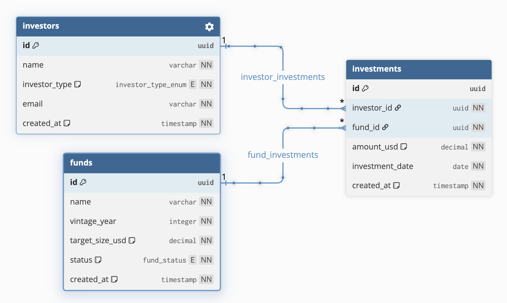

# Titanbay Private Markets API

A RESTful API for managing private market funds, investors, and investments, built with Node.js, TypeScript, and PostgreSQL.

---

## Prerequisites

- [Node.js](https://nodejs.org/) v24+
- [Docker](https://www.docker.com/) (for local PostgreSQL)

---

## Setup & First Run

### 1. Clone the repository

```bash
git clone <repo-url>
cd titanbay
```

### 2. Install dependencies

```bash
npm install
```

### 3. Configure environment variables

```bash
cp .env.example .env
```

### 4. Start the database

```bash
docker compose up -d
```

### 5. Setup the database schema

```bash
docker compose exec -T db psql -U postgres -d titanbay < schema.sql
```

### 6. Seed sample data

```bash
docker compose exec -T db psql -U postgres -d titanbay < seed.sql
```

### 7. Start the server

```bash
npm run dev
```

The API will be available at `http://localhost:3000`.

---

## Useful Commands

### Inspect the database

Connect to the database shell:

```bash
docker compose exec db psql -U postgres -d titanbay
```

Useful psql commands once connected:

```sql
\dt                    -- list all tables
\d funds               -- inspect funds table
SELECT * FROM funds;   -- query a table
\q                     -- exit
```

### Stop the database

```bash
docker compose down
```

---

## API Reference

The full API spec is available [here](https://storage.googleapis.com/interview-api-doc-funds.wearebusy.engineering/index.html).

### Endpoints

| Method | Endpoint                      | Description                                       |
| ------ | ----------------------------- | ------------------------------------------------- |
| GET    | `/funds`                      | List all funds                                    |
| POST   | `/funds`                      | Create a new fund                                 |
| PUT    | `/funds`                      | Update an existing fund                           |
| GET    | `/funds/:id`                  | Get a specific fund                               |
| GET    | `/investors`                  | List all investors                                |
| POST   | `/investors`                  | Create a new investor                             |
| GET    | `/funds/:fund_id/investments` | List all investments for a specific fund          |
| POST   | `/funds/:fund_id/investments` | Create a new investment to a fund                 |
| GET    | `/health`                     | Health check (returns server and database status) |

### Sample Requests

A Postman collection is included in the project root (`postman_collection.json`). Import it into Postman to run all endpoints with pre-configured requests.

After seeding, run `GET /funds` and `GET /investors` to retrieve the generated UUIDs and set them as the `fundId` and `investorId` collection variables.

---

## Data Model



### Design decisions

- **`PUT /funds` with `id` in request body** — implemented exactly as per the API spec despite standard REST convention being `PUT /funds/{id}` with the id as a URL parameter.

- **`investors.email` unique constraint** — considered the possibility of a shared inbox belonging to multiple investors. Assumed one email belongs to one investor for simplicity.

- **`investments.investment_date` not constrained to today or earlier** — considered whether to restrict investment dates to the past. Assumed future dates are valid to support use cases such as futures contracts, or investments signed today that become effective at a future date, as to avoid over-restricting the business logic.

- **`investments.created_at`** — added for consistency with the other tables, even though it was not in the original spec.

---

## Architecture

```
src/
  app.ts               # Express app setup, middleware, route registration
  server.ts            # HTTP server entry point
  db/
    pool.ts            # PostgreSQL connection pool
  routes/              # URL and method definitions
  controllers/         # Request/response handling, input validation
  services/            # Business logic
  repositories/        # Database queries
  schemas/             # Zod validation schemas
  middleware/
    errorHandler.ts    # Global error handler
  errors.ts            # Custom error classes
```

The service layer is intentionally thin for simple endpoints, acting as a pass-through to the repository. This follows a strict layered architecture where each layer only communicates with the layer directly below it, making the codebase easy to scale.

Business logic can be added to the service layer without touching controllers or repositories.

---

## Testing

Integration tests are used over unit tests because the service layer is thin and unit tests would test very little logic. Integration tests have been defined to verify real behaviour end-to-end, including routing, validation, business logic, and database interactions.

### Test database setup

Create the test database before running tests:

```bash
docker compose exec db psql -U postgres
```

```sql
CREATE DATABASE titanbay_test;
\q
```

Then run:

```bash
npm test
```

---

## Limitations

The following are known limitations, intentional by design given the scope of the spec:

- **No authentication or authorisation** — none was specified in the API spec.
- **No duplicate investment prevention** — two identical investment commitments from the same investor to the same fund on the same date are stored as separate records. Whether this represents a valid scenario or a data entry mistake depends on business semantics not defined in the spec.
- **No schema versioning** — there is no `schema_migrations` table tracking applied migrations. The `schema.sql` file represents the current state and can be re-run to reset the database.
- **No `updated_at` tracking** — records do not store when they were last modified.

---

## Future Extensions

- Add authentication and authorisation (e.g. OAuth)
- Introduce a migration tool (e.g. Prisma Migrate) to version schema changes
- Add pagination, sorting and filtering to list endpoints

---

## AI & Supporting Tools

This project was built with the assistance of the following tools:

**[Claude (Anthropic)](https://claude.ai)** via claude.ai and the Claude VS Code extension, used for:

- Generating DBML based on defined constraints per table for exporting data models into PostgreSQL
- Project scaffolding (setting up Docker, PostgreSQL and repository structure)
- Debugging
- Code reviews and suggesting refactors to polish the implementation
- Turning defined test cases into written tests
- Formatting this README :)

**[dbdiagram.io](https://dbdiagram.io)** — used for data modelling and exporting the schema to PostgreSQL.
